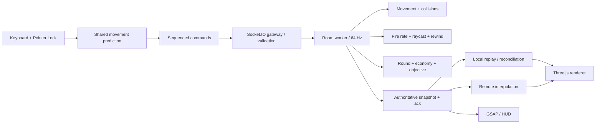

# KONTIR: professional texnik topshiriq va arxitektura

## 1. Maqsad va scope

Desktop brauzerda ishlaydigan 5v5 taktik FPS yaratiladi. Xaritalar original; Counter-Strike uslubidagi jamoaviy taktika, raund, aniqlik va skillga asoslangan harakat maqsad qilinadi. Valve resurslari yoki yopiq CS2 kodi loyihaga kiritilmaydi. “100% bir xil” fizika acceptance mezoni bo‘lmaydi: o‘lchanadigan harakat parametrlaridan foydalaniladi.

Repo ichida hozir ishlaydigan vertical slice mavjud. U quyidagi bosqichlar uchun boshlang‘ich kod, tayyor commercial release emas.

### Maqsadli platforma

- WebGL2 asosiy renderer; WebGPU capability tekshiruvidan keyingi alohida adapter.
- Zamonaviy Chrome/Edge/Firefox/Safari desktop, klaviatura va sichqoncha.
- Node.js authoritative server, 10 o‘yinchi/xona.
- Boshlang‘ich target: 1080p, o‘rta grafik preset, 60 FPS. Aniq GPU/CPU nomi release test matritsasida belgilanadi.
- Simulation 64 Hz; render chastotasiga bog‘liq emas.
- Boshlang‘ich snapshot 64/3 ≈ 21.3 Hz; input batch ≈ 32 Hz, command step 64 Hz.

## 2. Kod strukturasi

```text
KONTIR/
  package.json, package-lock.json, vite.config.js
  client/
    index.html
    public/
      icon.svg
      assets/                    # keyingi GLB/KTX2/audio aktivlari
    src/
      main.js                    # lifecycle, input, fixed-step loop
      rendering.js               # Three.js, PointerLockControls, kamera, modeller
      prediction.js              # command history, replay, correction smoothing
      network.js                 # Socket.IO, snapshot buffer, interpolation
      ui.js                      # GSAP, HUD, buy, lobby, scoreboard
      style.css
      world/
        chunks.js                # demo: procedural visual chunks + frustum
        glb-streamer.js           # optional: real GLB fetch/parse/dispose adapter
  server/
    src/
      index.js                   # transport, validation, rooms, tick scheduler
      room.js                    # authority: movement, combat, economy, objectives
      navigation.js              # bot navigation prototype
  shared/
    constants.js                 # tick, round, movement params, validation
    maps.js                      # map metadata + collision spatial index
    movement.js                  # client/server deterministic-step movement
    weapons.js                   # weapon configs, ray/AABB, hitbox definitions
  tests/
    game.test.js                 # mechanics and authority tests
    browser-smoke.mjs            # real browser flows
  docs/
    TECHNICAL_SPEC.md
    NETWORKING.md
    MAP_PIPELINE.md
  dist/                          # generated deploy artifact
```

Production’da `room.js`ni hajmi oshganda `CombatSystem`, `RoundSystem`, `EconomySystem`, `ObjectiveSystem`, `HistoryBuffer` modullariga ajrating. Renderer gameplay qarorlarini qabul qilmaydi; UI server holatini ko‘rsatadi.



## 3. Harakat talablari

Birliklar metr, soniya va radian. Y yuqoriga; kamera yaw=0 bo‘lganda -Z tomonga qaraydi. `PointerLockControls` faqat orientation/input qatlamida ishlatiladi. `controls.moveForward()` bilan collision/prediction tizimini chetlab o‘tmang.

`shared/movement.js` — bajariladigan boshlang‘ich implementatsiya. Klient `Prediction.simulate()` va server `Room.step()` aynan shu funksiyani chaqiradi.

### Boshlang‘ich parametrlar

| Parametr | Qiymat | Vazifa |
|---|---:|---|
| Maksimal yer tezligi | 5.5 m/s | normal yurish |
| Sekin yurish | 2.8 m/s | Shift |
| Cho‘kib yurish | 2.1 m/s | Ctrl |
| Ground acceleration | 10 | tezlikka chiqish |
| Friction | 6 | input to‘xtaganda sekinlashish |
| Stop speed | 2 m/s | kichik tezlikda to‘xtash |
| Gravity | 20 m/s² | o‘yin uchun sozlangan |
| Jump impulse | 6.2 m/s | vertikal boshlang‘ich tezlik |
| Standing / crouch | 1.8 / 1.15 m | collider balandligi |
| Step height | 0.32 m | zinapoyaga chiqish |

Yerda tezlikni `friction × max(speed, stopSpeed) × dt` bilan pasaytiring. Input yo‘nalishini normalizatsiya qilib, shu yo‘nalishdagi mavjud tezlikni dot product orqali o‘lchang. `addSpeed = wishSpeed − dot(velocity, wishDir)`; faqat musbat qoldiq miqdorida tezlanish bering.

Havoda ground friction ishlatilmaydi. Air acceleration alohida `airWishCap` bilan cheklanadi. Fresh jump input frictiondan avval qo‘llanadi: to‘g‘ri timing momentumni saqlaydi; Space’ni ushlab turish avtomatik bunny-hop emas. Prototipdagi 9 m/s cap ataylab mavjud va CS original parametri emas.

### Collision va kengaytirish

Hozir character AABB, statik AABB colliderlar, spatial hash, kichik substeplar, step-up va ceiling test bor. Player-player collision va qiya pol uchun capsule sweep/slide, slope limit, depenetration va ground snapping kerak. Buni Rapier character controller yoki custom swept capsule orqali joriy eting; client/server bir xil sozlama va aktivlardan foydalansin.

Acceptance:

- 30/60/144 Hz renderda 10 soniyalik bir xil input natijasi simulyatsiya ticklari bo‘yicha teng.
- Diagonal tezlik to‘g‘ri chiziqdan yuqori emas.
- 0.25 m zinapoyadan chiqadi; 1 m devordan o‘tmaydi.
- Past shift ostida standing holatga majburan turmaydi.
- Devorga sirpanish va sakrashda cheksiz tezlanish bo‘lmaydi.
- Server klient `position`, `velocity`, `dt` qiymatlariga ishonmaydi.

## 4. Qurol va zarar

`shared/weapons.js` uch original parametrli qurolni saqlaydi. Server qurolning cadence, magazine, reserve, reload deadline va mavjudligini tekshiradi. Klient “men tegizdim” degan qaror yubormaydi.

### Hitscan va parvoz vaqti

Asosiy rifle/pistol/SMG hitscan: raycast serverdagi qabul qilingan shot tickida yechiladi. Vizual tracer davomiyligi zarar hisobiga ta’sir qilmaydi. Bu turdagi gameplay uchun barcha o‘qlarga sun’iy parvoz delay qo‘shish talab qilinmaydi.

Projectile rejimi keyin kerak bo‘lsa, alohida `ProjectileSystem`da velocity/gravity/lifetime va previous→current swept segment collision ishlating. Uni hitscan lag compensation bilan bitta yo‘lga aralashtirmang.

### Spray/recoil

- Har qurolning ketma-ket angular recoil jadvali bor.
- Burst oralig‘i 0.3 soniyadan oshsa pattern qayta boshlanadi.
- Harakat va havoda bo‘lish spread’ni oshiradi.
- Pattern serverda tanlanadi; random spread urug‘i serverda yaratiladi.
- Klient kamera/viewmodel kick’ni ko‘rsatishi mumkin, ammo bullet direction server raycastidan olinadi.
- “Spray control”: o‘yinchi kamera pitch/yaw’ini patternning qarama-qarshi tomoniga tuzatadi.

### Hitboxlar

Prototip: head ×3.5, chest ×1, legs ×0.7. Zirh head/chest zararning bir qismini yutadi. Server avval dunyodagi eng yaqin collider masofasini topadi, so‘ng undan yaqin hitboxni tekshiradi. Shu sabab devor ortidagi nishonga o‘q tegmaydi. Penetratsiya yo‘q.

Production: animatsiya pose’iga mos kapsula/OBB yoki bone hitboxlar. Pose tickini history bilan saqlang. Visual pose va authoritative pose vaqtini moslang. Friendly fire qoidasi alohida konfiguratsiya; hozir o‘chiq.

Acceptance: fire-rate spam cheklangan; magazin manfiy bo‘lmaydi; reload paytida o‘q uzilmaydi; cover damage’ni bloklaydi; dead player fire qila olmaydi; head/chest/legs farqli zarar beradi; respawn oldingi history hitini qabul qilmaydi.

## 5. Raund, iqtisod va maqsad

```text
LOBBY -> BUY (12 s) -> LIVE (105 s)
                         |
                         +-- plant -> bomb timer (35 s)
                         |
                         +-- win -> ROUND_END (5 s) -> BUY
                                      |
                                      +-- 7 wins -> MATCH_END
```

T va CT jamoalari serverda tenglashtiriladi. Hozir 7 g‘alabagacha qisqa competitive; side swap/overtime yo‘q. To‘liq ranked format alohida rule presetda belgilansin: masalan 12 raunddan keyin side swap, 13 g‘alaba, 12:12 holatda overtime. Buni “CS2’ning doimiy rasmiy qoidasi” deb hardcode qilmang.

Plant shartlari: tirik T, qurilma tashuvchisi, A/B radiusi, yerda, harakatsiz, E uzluksiz 3.2 soniya, otish/reload yo‘q. Tashuvchi o‘lsa yoki uzilsa qurilma uning joyida qoladi. Boshqa T yaqinlashsa oladi.

Defuse shartlari: tirik CT, planted qurilmadan 2 m ichida, harakatsiz, E uzluksiz 5 soniya. Input yo‘qolishi yoki harakat progressni reset qiladi. Vaqt klient/GSAP timeridan olinmaydi.

CT g‘alabasi: T yo‘q va qurilma planted emas; vaqt tugadi va planted emas; yoki defuse tugadi. T g‘alabasi: CT yo‘q yoki qurilma taymeri tugadi. Bomba planted bo‘lsa normal round timer raundni tugatmaydi. Bir tick ichidagi holatlar tartibi test bilan belgilanadi; hozir defuse yakuni objective bosqichida, explosion esa undan keyin tekshiriladi.

Economy prototype: boshlang‘ich $3200, kill +$300, win +$2500, loss +$1800, plant +$300. Max $16000. Iqtisod o‘yin qoidasi sifatida o‘zgartiriladi; client faqat buy request yuboradi. Buy faqat BUY fazada, tirik o‘yinchiga. Inventar prototipda bitta faol qurol.

Deathmatch: 180 soniya, 3 soniya respawn, score kills/deaths bo‘yicha. Bomb qoidalari o‘chiq.

## 6. Render va aktivlar

Three.js sahna, PBR material, bitta DirectionalLight shadow, HemisphereLight va environment map. GSAP UI transition’lar uchun; gameplay uchun `setTimeout`/animation callback ishlatilmaydi.

Blender pipeline va chunk/PVS dizayni [MAP_PIPELINE.md](MAP_PIPELINE.md)da. Demo aktivlari procedural; keyingi GLB’lar original yaratiladi.

Bloom kerak bo‘lsa optional preset sifatida:

```js
import { EffectComposer } from 'three/addons/postprocessing/EffectComposer.js';
import { RenderPass } from 'three/addons/postprocessing/RenderPass.js';
import { UnrealBloomPass } from 'three/addons/postprocessing/UnrealBloomPass.js';
import { OutputPass } from 'three/addons/postprocessing/OutputPass.js';
import { Vector2 } from 'three';

const composer = new EffectComposer(renderer);
composer.addPass(new RenderPass(scene, camera));
composer.addPass(new UnrealBloomPass(new Vector2(width, height), 0.15, 0.3, 1.1));
composer.addPass(new OutputPass());
// Render loopda renderer.render o‘rniga composer.render ishlatiladi.
// Resize’da composer.setSize, teardown’da barcha pass/targetlar dispose qilinadi.
```

Motion blur uchun previous/current transform va velocity buffer asosidagi pass kerak. Oddiy afterimage aniqlikni buzadi va haqiqiy motion blur emas. Competitive presetda o‘chiq qoldiring; viewmodel blur’ini alohida mask bilan boshqaring.

WebGPU migration: capabilities → renderer adapter → material/shader adapter → pass graph. `WebGLRenderer`ni bir qatorda almashtirib barcha shader/pass’lar ishlashini taxmin qilmang. Gameplay/network modullari rendererga bog‘lanmasin.

## 7. Server masshtablash

Demo bitta Node processda cheklangan xonalarni yuritadi. Production’da:

1. Gateway: auth, connection admission, account/session, matchmaking.
2. Har match bitta simulation worker/processga tegishli. Bir xonani bir nechta server bir vaqtda simulyatsiya qilmaydi.
3. Coordinator mavjud worker sig‘imi bo‘yicha xona ajratadi.
4. Redis session/room discovery va gateway pub/sub uchun; physical state’ni har tick DBga yozmang.
5. PostgreSQL account, match summary, bans, rating uchun; async natija queue’si.
6. Static GLB/KTX2/audio CDN; immutable hashli aktivlar.
7. Match replay: accepted inputs, match seed, config/map hash va authoritative milestone’lar.

Socket.IO adapter qo‘shishning o‘zi fizikani worker’larga bo‘lmaydi. Long polling yoqilgan multi-node deployment’da sticky-session talabini tekshiring; WebSocket-only rejimda ham room owner routing kerak.

Observability: tick p50/p95/p99, overdue tick, event loop lag, room/player count, input queue length, rejected packets, bytes/s, RTT/jitter, reconciliation xatosi, snapshot drop, memory, GLTF decode duration.

## 8. Bosqichlar va tugallanish mezonlari

| Bosqich | Natija | Qabul mezoni |
|---|---|---|
| 0 — Hozirgi slice | 2 map, movement, botlar, rooms, rounds | `npm test`, build va browser smoke o‘tadi |
| 1 — Movement polish | capsule/slope/player collision | 30/60/144 render profillarida qayta ijro testi |
| 2 — Combat polish | weapon inventory, animation pose, audio | hit/cover/reload/rewind regression suite |
| 3 — Art streaming | Blender GLB, KTX2, portals/PVS, LOD | xotira budjeti va 10 min leak soak testi |
| 4 — Network hardening | auth, reconnect, visibility sets, binary | 100–200 ms RTT, jitter/loss, spoof/flood test |
| 5 — Match format | side swap, overtime, buy zones, spectators | barcha win-condition kombinatsiyalari |
| 6 — Scale/release | worker routing, metrics, deployment | belgilangan hardware’da 10-player load va soak |

60 FPS acceptance: maqsadli qurilmada p95 frame time ≤16.7 ms; GPU/CPU alohida o‘lchanadi. Bu hujjatdagi limit maqsad, hozir barcha qurilmalarda erishilgan natija emas. Server 64 Hz qadam budjeti 15.625 ms; worker ichidagi umumiy xonalar yuklamasiga qarab sig‘im topiladi.

## 9. Rasmiy manbalar

- [Three.js PointerLockControls](https://threejs.org/docs/pages/PointerLockControls.html)
- [Three.js Frustum](https://threejs.org/docs/pages/Frustum.html)
- [Three.js GLTFLoader](https://threejs.org/docs/pages/GLTFLoader.html)
- [Socket.IO delivery guarantees](https://socket.io/docs/v4/delivery-guarantees/)
- [GSAP Timeline](https://gsap.com/docs/v3/GSAP/Timeline/)

Parametrlar va ishlab chiqarish budjetlari KONTIR uchun taklif qilingan dizayn qarorlari; rasmiy CS2 xususiyatlari sifatida talqin qilinmaydi.
